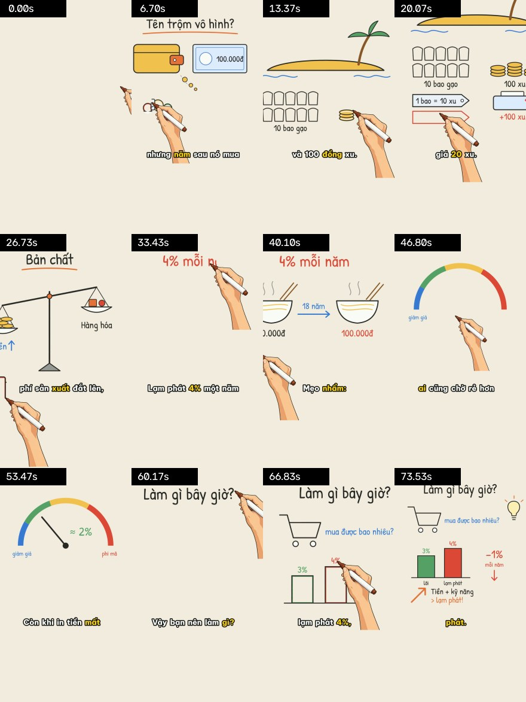
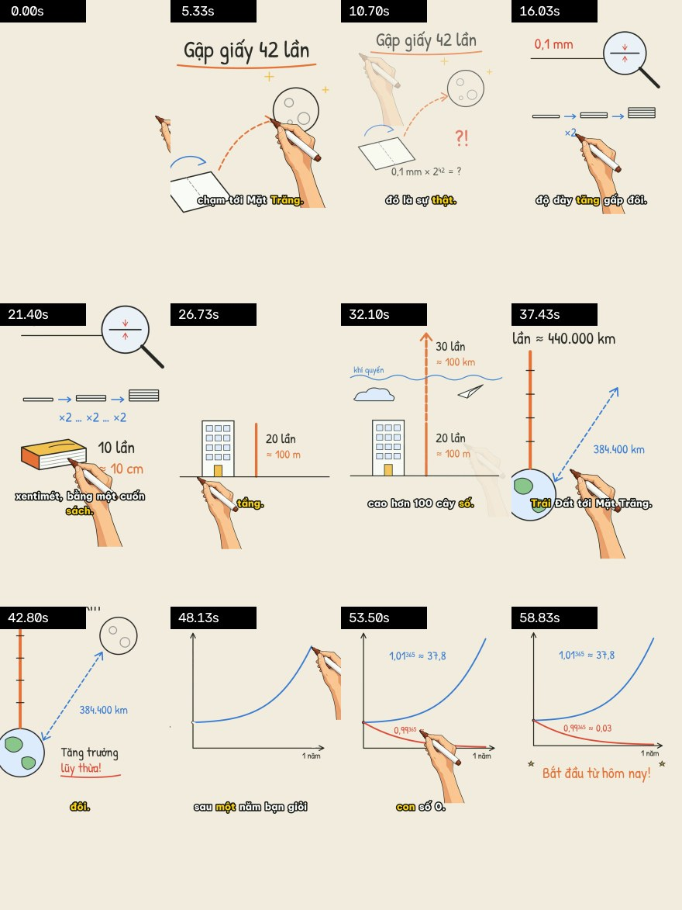

# Whiteboard Video – vẽ tay + giọng đọc, từ một prompt

Biến **một chủ đề, một kịch bản (kể cả kịch bản rất dài), hoặc file SRT + giọng thu sẵn** thành video giải thích kiểu whiteboard. Trong video:
- một bàn tay cầm bút vẽ từng nét **đúng lúc lời thoại nhắc tới**;
- màu được tô vào sau khi vẽ nét, camera bám theo chỗ đang vẽ;
- có giọng đọc tiếng Việt, phụ đề karaoke, nhạc nền và tiếng bút sột soạt.

Một dự án xuất được cùng lúc **9:16 cho TikTok/Shorts**, **16:9 cho YouTube** và **1:1**.

Repo được thiết kế để **một agent (Claude Code, Codex…) làm trọn một video từ một câu lệnh**: agent viết kịch bản, tự vẽ cảnh bằng SVG, chạy một lệnh là ra MP4, rồi tự xem ảnh QA để kiểm tra.


<details><summary>Ví dụ TikTok 9:16: "Lạm phát là gì?" (70s, giọng VieNeu Hải Đăng, <code>examples/lam-phat</code>)</summary>


</details>

<details><summary>Ví dụ TikTok 9:16: "Gập giấy 42 lần tới Mặt Trăng?" (<code>examples/showcase-gap-giay</code>)</summary>


</details>

---

## 1. Bắt đầu nhanh

### Cách 1: nhờ agent (khuyên dùng)

Mở repo trong Claude Code / Codex và nói, ví dụ:

> Làm video TikTok 60 giây giải thích lạm phát là gì, dễ hiểu, giọng nam.

> Đây là kịch bản dài của tôi (file .docx/.txt). Rút gọn giữ phần cốt lõi rồi làm video YouTube 10 phút.

> Tôi có file `giong.mp3` và `phu-de.srt`, biến nó thành video vẽ tay 16:9.

Agent đọc [`AGENTS.md`](AGENTS.md) / [`CLAUDE.md`](CLAUDE.md), rồi làm theo quy trình trong [`SKILL.md`](SKILL.md):
1. Viết kịch bản, câu đầu phải có hook.
2. Vẽ từng cảnh SVG.
3. Render bản nháp, xem ảnh QA để tự kiểm tra.
4. Sửa những chỗ chưa ổn.
5. Xuất bản chính thức vào `projects/<tên>/out/`.

### Cách 2: tự chạy

```bash
python scripts/prepare_env.py          # lần đầu: tạo .venv, cài thư viện (không cần ffmpeg);
                                       # dòng cuối in ENV_PY=<python của .venv>
PY=.venv/bin/python                    # Windows: .venv\Scripts\python.exe

$PY scripts/make_video.py --init projects/vi-du            # tạo khung dự án mới
$PY scripts/make_video.py projects/vi-du/video.json --draft # nháp: nửa độ phân giải, 15 fps
$PY scripts/make_video.py projects/vi-du/video.json         # bản chính thức
```

Thử ngay với ví dụ có sẵn: `$PY scripts/make_video.py examples/lam-phat/video.json`.

Tuỳ chọn hay dùng:

| Tuỳ chọn | Tác dụng |
|---|---|
| `--formats portrait,landscape,square` | chọn định dạng xuất (mặc định lấy từ `video.json`) |
| `--scenes scene-02,scene-05` | chỉ làm lại vài cảnh |
| `--engine silent` | không gọi TTS: dựng nháp đúng nhịp khi không có mạng |
| `--no-cache` | xoá `build/` và làm lại từ đầu |
| `--jobs 4` | số tiến trình render song song |

Mọi script in `OUTPUT=<đường dẫn>` ở dòng cuối, nên agent lấy kết quả được ngay.

---

## 2. Một dự án gồm những gì

```text
projects/vi-du/
  video.json          cấu hình + lời thoại từng cảnh
  scenes/scene-01.svg cảnh do agent (hoặc bạn) vẽ
  build/              cache: xoá lúc nào cũng được
  out/                kết quả
```

`video.json` tối thiểu:

```json
{
  "title": "Lạm phát là gì?",
  "formats": ["portrait"],
  "voice": { "engine": "vieneu", "voice": "Hải Đăng", "style": "podcast" },
  "music": { "generate": "calm", "volumeDb": -24 },
  "scenes": [
    { "id": "scene-01", "svg": "scenes/scene-01.svg",
      "narration": "Có một tên trộm lấy tiền của bạn mỗi ngày, mà không cần mở ví. …" }
  ]
}
```

Trong SVG, mỗi nhóm cấp cao nhất là một "phần tử" được vẽ lần lượt. Thuộc tính `data-say` là cụm từ **nguyên văn** trong lời thoại: phần tử bắt đầu được vẽ ngay trước khi giọng đọc nói tới cụm từ đó.

```xml
<g id="note" data-label="Tờ 100 nghìn" data-say="100 nghìn"> … </g>
```

Schema đầy đủ: [`docs/PROJECT_FORMAT.md`](docs/PROJECT_FORMAT.md). Cách vẽ cảnh: [`docs/SVG_GUIDE.md`](docs/SVG_GUIDE.md).

Kết quả trong `out/`:

| File | Nội dung |
|---|---|
| `<tên>-portrait.mp4` / `-landscape.mp4` / `-square.mp4` | video H.264 + AAC, −14 LUFS |
| `<tên>.srt` | phụ đề theo từng từ đã đọc |
| `<tên>-<định dạng>-qa.jpg` | contact sheet 12 khung hình để kiểm tra nhanh |
| `<tên>-report.json` | thời lượng từng cảnh, loudness, đỉnh âm, số khung |

---

## 3. Pipeline hoạt động thế nào

```text
video.json
  │
  ├─ 1. scenes   SVG → PNG + nét vector (svg_scene.py) · ảnh raster → tự chia vùng (auto_annotate.py)
  ├─ 2. voice    TTS từng cảnh + timestamp từng từ (tts.py, voice_studio.py) → cache theo nội dung
  ├─ 3. sync     mỗi phần tử bắt đầu vẽ khi cụm data-say được đọc (timing.py)
  ├─ 4. render   vẽ từng cảnh song song: nét bút, tô màu, bàn tay, camera (render_stream_whiteboard.py)
  ├─ 5. audio    giọng + nhạc nền (tự hạ khi có giọng) + tiếng bút → chuẩn hoá −14 LUFS
  └─ 6. compose  ghép cảnh, chuyển cảnh, phụ đề karaoke, xuất từng định dạng + QA
```

Hai bất biến luôn được giữ:
1. Phần tử chưa tới lượt không bao giờ lộ pixel nào.
2. Mỗi cảnh có đúng `round(ms × fps / 1000)` khung hình, và số mẫu âm thanh khớp tuyệt đối.

Nhờ vậy tiếng và hình không bao giờ lệch nhau.

### Giọng đọc

- **Mặc định:** VieNeu-TTS, giọng nam **Hải Đăng**.
  - Chạy offline trên CPU, miễn phí, giấy phép Apache-2.0.
  - Cài bằng `prepare_env`. Nếu chưa cài được, pipeline tự dùng giọng Edge `vi-VN-NamMinhNeural`.
- **Phong cách đọc (`style`):** `natural`, `news`, `story`, `podcast`, `ads`. Voice Studio port từ [ttspromax](https://github.com/vansyson1308/ttspromax):
  - đọc từng câu với ngữ điệu riêng;
  - khoảng lặng giữa các câu theo phong cách;
  - tự thêm chỗ lấy hơi trong câu dài.
- **Tinh chỉnh trong lời thoại:**
  - Chèn `[pause 600ms]` để ngắt nghỉ có chủ ý; thẻ này không hiện trong phụ đề.
  - `"lexicon": {"GPT": "gi pi ti"}` dạy cách đọc từ viết tắt.
- **Xử lý âm thanh `"fx": "broadcast"`** (mặc định): lọc ù, làm rõ tiếng, nén nhẹ như giọng phát thanh.
- **Tự đọc lại câu lỗi:** câu VieNeu đọc lan man hoặc nuốt chữ được đọc lại, giữ bản tốt nhất.
- **Engine khác:**

  | Engine | Cần | Ghi chú |
  |---|---|---|
  | `vieneu` | không | 25 giọng Việt: nam Hải Đăng, Thiện Minh, Minh Đức, Thanh Bình…; nữ Mai Anh, Ngọc Linh… |
  | `edge` | không | HoaiMy / NamMinh, timestamp thật |
  | `gemini` | `GEMINI_API_KEY` | giọng LLM, làm theo chỉ dẫn phong cách |
  | `elevenlabs` | `ELEVENLABS_API_KEY` | timestamp ký tự, mặc định giọng Việt |
  | `openai` | `OPENAI_API_KEY` | `OPENAI_BASE_URL` để trỏ tới server tương thích |
  | `fish` | `FISH_API_KEY` | clone giọng, **chỉ khi chính chủ đồng ý** |
  | `silent` | không | im lặng, để thử nhịp |
  | giọng thu sẵn | — | `"voice": null, "audio": {"file": "giong.mp3", "srt": "phu-de.srt"}` |

  Danh sách giọng: `$PY scripts/tts.py --list-voices vieneu`. Xem trước cách một đoạn sẽ được đọc: `$PY scripts/voice_studio.py "Lời thoại…" --style story`.

  Engine không trả timestamp được căn thời gian theo khoảng lặng trong audio, sai số khoảng 0,1 s. `tiktok` / `makevoice` chỉ nên dùng làm nháp.

### Nét vẽ

- **Cảnh SVG:** bút đi theo nét vector thật, chữ được "viết tay" từ trái sang phải.
- **Ảnh raster:** bút đi theo skeleton của nét, theo thứ tự gần nhất để tay không nhảy lung tung.
- **Nhịp tay người** (`render.humanMotion`, mặc định bật):
  - bút tăng tốc ở đầu nét, chậm lại ở góc cua và cuối nét;
  - dừng một nhịp khi đặt bút và khi nhấc bút;
  - bàn tay nhấc khỏi giấy khi chuyển nét (`render.penLift`).
- **Camera `follow`:** zoom mượt vào phần tử đang vẽ, lùi ra toàn cảnh ở cuối mỗi cảnh.
- **Bàn tay:** mặc định không có chữ. `brand_hand.py "Tên kênh"` in tên kênh lên bút.

### Âm thanh và phụ đề

- Nhạc nền tự tạo, không lo bản quyền: `"music": {"generate": "calm" | "bright"}`. Hoặc dùng file nhạc của bạn.
- Nhạc tự hạ khi có giọng (ducking). Tiếng bút tổng hợp chỉ phát khi đang vẽ.
- Phụ đề karaoke font Be Vietnam Pro, nằm trong vùng an toàn của TikTok.

---

## 4. Dành cho agent / người phát triển

- **Đọc trước:**
  - [`SKILL.md`](SKILL.md): quy trình từ prompt ra video, tuỳ chọn hay dùng, xử lý sự cố.
  - [`docs/SVG_GUIDE.md`](docs/SVG_GUIDE.md): quy ước vẽ cảnh.
  - [`docs/PROJECT_FORMAT.md`](docs/PROJECT_FORMAT.md): mọi trường của `video.json`.
- **Kịch bản dài:** chia 25–60 từ mỗi cảnh, mỗi cảnh một ý, 3–6 phần tử. Mỗi `data-say` là 1–3 từ xuất hiện nguyên văn một lần trong lời thoại của cảnh. Với video dài, nên sinh SVG bằng một script nhỏ dùng các hình mẫu chung (người, bánh xe, hộp chữ…) để giữ phong cách thống nhất.
- **Kiểm tra trước khi xuất:**
  - xem `out/*-qa.jpg`;
  - đọc log `-- sync` (phần tử nào bắt đầu lúc nào);
  - rà chữ tiếng Việt: font viết tay không có ký tự mũi tên ↑↓ → nên hãy vẽ mũi tên bằng `<path>`.
- **Quy ước code:**
  - Python 3.10+, dùng PyAV, không cần ffmpeg hệ thống.
  - Thời gian tính bằng ms, toạ độ annotation là pixel nguyên.
  - Giữ hai bất biến của renderer ở phần 3.
- **Test** (offline, khoảng 1 phút; chạy trước khi commit thay đổi trong `scripts/`):

  ```bash
  $PY -m pytest -q tests
  ```

### Giao video dài (> 30 MB) từ phiên cloud

Chat chỉ đính kèm được file ≤ 30 MB. Với video dài, dùng:

```bash
$PY scripts/share_video.py out/video.mp4 --title "Tên video"   # [--chunk-mb 14] [--out-dir share/]
```

Script cắt video thành các phần ≤ 14 MB, không nén lại, rồi tạo trang `index.html` kèm manifest (kích thước, SHA-256).
Agent publish trang này thành một Artifact riêng tư với capability `downloads`. Mỗi lượt publish ≤ 60 MB; các lượt sau dùng cùng trang và cộng dồn file.
Người dùng mở link rồi bấm **Tải video**: trang ghép lại đúng từng byte, kiểm tra SHA-256 và phát. Bấm **Lưu video (.mp4)** để lưu bản gốc về máy.

### Xử lý sự cố

| Triệu chứng | Cách xử lý |
|---|---|
| `edge-tts failed … certificate` | đặt `SSL_CERT_FILE=<ca-bundle>` |
| không có mạng | `--engine silent` để dựng nháp đúng nhịp |
| phần tử vẽ sai lúc | `data-say` không khớp nguyên văn lời thoại; xem log `-- sync` |
| vùng vẽ sai (ảnh raster) | mở `assets/preview.html`, chỉnh vùng, lưu, chạy lại |
| muốn làm lại từ đầu | `--no-cache` hoặc xoá `build/` |
| video quá lớn để gửi qua chat | `scripts/share_video.py` (xem trên) |

### Quy trình cũ (SRT + ảnh + chỉnh tay) vẫn dùng được

```bash
$PY scripts/parse_srt.py phu-de.srt                          # gợi ý chia cảnh 25–35s
$PY scripts/auto_annotate.py scene-01.png --elements 4       # tự chia vùng (hoặc chỉnh trong assets/preview.html)
$PY scripts/render_stream_whiteboard.py scene-01.png scene-01.annotation.json scene-01.mp4 --size 1920x1080
```

---

## 5. Cấu trúc repo

```text
scripts/
  make_video.py                 pipeline một lệnh (dùng cái này)
  render_stream_whiteboard.py   renderer: mask choreography, nét liên tục, nhịp tay người, camera
  svg_scene.py                  SVG → PNG + nét vector + label map
  auto_annotate.py              ảnh raster → annotation tự động
  tts.py  voice_studio.py       giọng đọc: 9 engine, phong cách đọc, căn thời gian từng từ
  timing.py                     đồng bộ phần tử theo từ
  captions.py  wb_video.py      phụ đề; I/O video & âm thanh (PyAV), xử lý giọng, loudness
  gen_music.py                  nhạc nền procedural
  qa_frames.py  render_annotation_preview.py  brand_hand.py  generate_images.py
  share_video.py                giao video lớn: cắt phần + trang xem/tải bản gốc
  stream_render.py  parse_srt.py  merge_scenes.py  prepare_env.py
assets/     bàn tay, font tiếng Việt (OFL), preview.html
examples/   demo-bau-troi (16:9 + 9:16) · showcase-gap-giay (9:16) · lam-phat (9:16)
docs/       SVG_GUIDE.md · PROJECT_FORMAT.md · RESEARCH.md (nghiên cứu + lộ trình)
tests/      bộ test chạy offline
```

## Ghi công & giấy phép

Fork từ skill `srt-whiteboard-animation` gốc (MIT) của tác giả "江哥是老登啊". Ý tưởng mask choreography + stream strokes và ảnh ví dụ con khỉ thuộc về tác giả gốc.

- **Voice Studio:** port từ [ttspromax](https://github.com/vansyson1308/ttspromax).
- **VieNeu-TTS:** Apache-2.0.
- **Font Be Vietnam Pro và Patrick Hand:** SIL Open Font License (`assets/fonts/OFL-*.txt`).
- **Mã nguồn repo:** MIT, xem [LICENSE](LICENSE).
