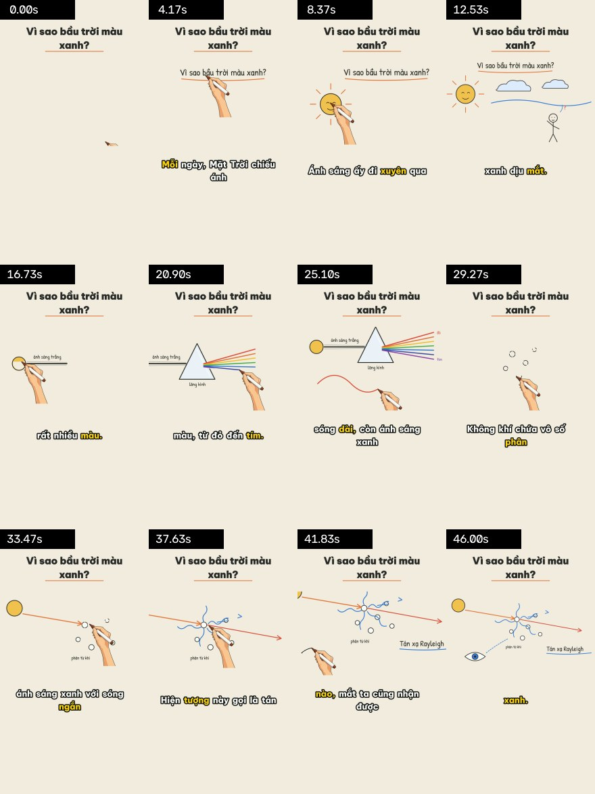

# Whiteboard Video – vẽ tay + giọng đọc, từ một prompt

Biến **một chủ đề, một kịch bản, hoặc file SRT** thành video giải thích kiểu whiteboard: bàn tay cầm bút vẽ từng nét đúng lúc lời thoại nhắc tới, tô màu, camera bám theo, phụ đề karaoke tiếng Việt, nhạc nền và tiếng bút sột soạt – xuất sẵn **9:16 cho TikTok/Shorts** và **16:9 cho YouTube**.

Được thiết kế để **Claude Code / Codex làm toàn bộ video từ một câu lệnh**: agent viết kịch bản, tự vẽ cảnh bằng SVG, chạy một lệnh là ra MP4.


<details><summary>Bản dọc 9:16 (contact sheet QA)</summary>


</details>

## Dùng với agent (cách nhanh nhất)

Mở repo trong Claude Code hoặc Codex và nói:

> Làm video TikTok 45 giây giải thích vì sao lá cây có màu xanh, giọng nữ, có nhạc nền nhẹ.

Agent sẽ làm theo [SKILL.md](SKILL.md): viết kịch bản có hook → vẽ 3–5 cảnh SVG → render nháp để tự kiểm tra → xuất bản chính thức vào `projects/<tên>/out/`.

## Dùng thủ công

```bash
python scripts/prepare_env.py                 # lần đầu: tạo .venv và cài thư viện (không cần ffmpeg)
.venv/bin/python scripts/make_video.py examples/demo-bau-troi/video.json --draft   # nháp nhanh
.venv/bin/python scripts/make_video.py examples/demo-bau-troi/video.json           # bản chính thức
```
(Windows: `.venv\Scripts\python.exe`.) Tạo dự án mới: `make_video.py --init projects/ten-video`.

Một dự án chỉ là một file `video.json` + các cảnh:

```json
{
  "title": "Vì sao bầu trời màu xanh?",
  "formats": ["portrait", "landscape"],
  "voice": { "engine": "edge", "voice": "vi-VN-NamMinhNeural", "rate": "+8%" },
  "scenes": [
    { "svg": "scenes/scene-01.svg", "narration": "Bạn có bao giờ tự hỏi: vì sao bầu trời lại có màu xanh? …" }
  ]
}
```

Trong SVG, mỗi nhóm `<g data-say="mặt trời">` sẽ được vẽ đúng lúc giọng đọc nói "mặt trời". Xem [docs/SVG_GUIDE.md](docs/SVG_GUIDE.md) và [docs/PROJECT_FORMAT.md](docs/PROJECT_FORMAT.md).

## Tính năng

| | |
|---|---|
| ✍️ **Vẽ như người thật** | Cảnh SVG: bút đi theo nét vector thật, chữ được viết tay trái→phải. Ảnh raster: bút đi theo skeleton của nét, thứ tự gần-nhất để tay không nhảy. Tô màu sau khi vẽ nét. |
| 🗣️ **Giọng đọc tiếng Việt miễn phí** | edge-tts (HoaiMy / NamMinh) có timestamp từng từ; hỗ trợ ElevenLabs, OpenAI TTS, hoặc giọng bạn tự thu + SRT. |
| 🎯 **Nói tới đâu vẽ tới đó** | Mỗi phần tử có `say`; phần tử đầu vẽ ngay từ 0.15s (hook). |
| 🎥 **Camera** | Zoom mượt vào phần tử đang vẽ, lùi ra toàn cảnh cuối mỗi cảnh; chuyển cảnh fade/slide. |
| 💬 **Phụ đề karaoke** | Be Vietnam Pro, viền đậm, highlight từ đang đọc, nằm trong vùng an toàn TikTok; xuất kèm `.srt`. |
| 🎵 **Âm thanh chuẩn nền tảng** | Nhạc nền tự hạ khi có giọng (ducking), tiếng bút tổng hợp khi đang vẽ, chuẩn hoá -14 LUFS. |
| 📐 **Đa định dạng** | 1080×1920, 1920×1080, 1080×1080 từ cùng một dự án; tiêu đề tự động cho bản dọc. |
| ⏱️ **Không lệch tiếng** | Số khung và số mẫu âm thanh của từng cảnh khớp tuyệt đối. |
| ⚡ **Nhanh & có cache** | Render song song, ghi H.264 trực tiếp; sửa một cảnh chỉ render lại cảnh đó. Demo 46s, 2 định dạng 1080p ≈ 2 phút trên 4 CPU. |
| 🔍 **QA tự động** | Contact sheet + báo cáo JSON cho mỗi video để agent tự kiểm tra. |
| 🖊️ **Thương hiệu riêng** | Bàn tay không chữ mặc định; `brand_hand.py "Tên kênh"` in tên kênh lên bút. |

## Quy trình cũ (SRT + ảnh + chỉnh tay) vẫn dùng được

```bash
python scripts/parse_srt.py phu-de.srt                          # gợi ý chia cảnh 25–35s
python scripts/auto_annotate.py scene-01.png --elements 4       # tự chia vùng (hoặc tự chỉnh trong assets/preview.html)
python scripts/render_stream_whiteboard.py scene-01.png scene-01.annotation.json scene-01.mp4 --size 1920x1080
```
Hoặc để `make_video.py` lo hết: `"voice": null, "audio": {"file": "giong.mp3", "srt": "phu-de.srt"}`.

`assets/preview.html` (mở bằng Chrome/Edge) cho phép kéo thả vùng, đổi thứ tự, chỉnh thời gian và cụm từ `say`.

## Cấu trúc

```text
scripts/
  make_video.py                 pipeline một lệnh
  render_stream_whiteboard.py   renderer cảnh (mask choreography + nét liên tục + camera)
  svg_scene.py                  SVG → PNG + nét vector + label map
  auto_annotate.py              ảnh raster → annotation tự động
  tts.py  timing.py             giọng đọc + đồng bộ theo từ
  captions.py  wb_video.py      phụ đề, I/O video & âm thanh (PyAV)
  qa_frames.py  render_annotation_preview.py  brand_hand.py  generate_images.py
  stream_render.py  parse_srt.py  merge_scenes.py  prepare_env.py
assets/   bàn tay (drawing-hand-clean.png), font tiếng Việt (OFL), preview.html
examples/demo-bau-troi/         dự án mẫu hoàn chỉnh (3 cảnh SVG)
docs/     SVG_GUIDE.md, PROJECT_FORMAT.md, RESEARCH.md (nghiên cứu + lộ trình)
tests/    bộ test chạy offline
```

## Kiểm thử

```bash
.venv/bin/python -m pytest -q tests
```

## Ghi công & giấy phép

Fork từ skill `srt-whiteboard-animation` gốc (MIT) của tác giả "江哥是老登啊" – ý tưởng mask choreography + stream strokes và ảnh ví dụ con khỉ thuộc về tác giả gốc. Font Be Vietnam Pro và Patrick Hand theo SIL Open Font License (`assets/fonts/OFL-*.txt`). Mã nguồn: MIT, xem [LICENSE](LICENSE).
